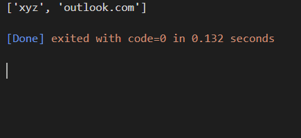

# Package/Script Name

Short description of package/script

- This is an Standalone Script that seperates the name and the domain name from the inputed email

## Setup instructions

This is just an simple Stand Alone Fine dosent need any setup just email in input or argument in the function

## Detailed explanation of script, if needed

This script just seperate the email string from "@"

## Output

## Author(s)

[Vivek Raj Gupta](https://github.com/Vivek-raj-gupta-2002)
